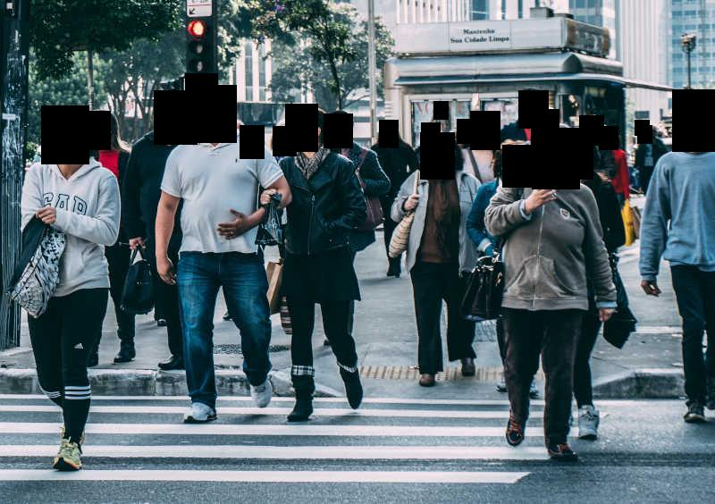

# `deface`: Video anonymization by face detection

`deface` is a simple command-line tool for automatic anonymization of faces in videos or photos.
It works by first detecting all human faces in each video frame and then applying an anonymization filter (blurring or black boxes) on each detected face region.
All audio tracks are discarded as well.


<div id="images" style="display: flex;">
<figure>
    <figcaption><b>Original</b></figcaption>
    
</figure>

<figure>
    <figcaption><b><tt>deface</tt> output (using default options)</b></figcaption>
    
</figure>
</div>

## Installation

`deface` supports all commonly used operating systems (Linux, Windows, MacOS), but it requires using a command-line shell such as bash. There are currently no plans of creating a graphical user interface.

The recommended way of installing `deface` is via the `pip` package manager. This requires that you have Python 3.6 or later installed on your system. It is recommended to set up and activate a new [virtual environment](https://realpython.com/python-virtual-environments-a-primer/) first. Then you can install the latest release of `deface` and all necessary dependencies by running:

    $ python3 -m pip install deface

Alternatively, if you want to use the latest (unreleased) revision directly from GitHub, you can run:

    $ python3 -m pip install 'git+https://github.com/ORB-HD/deface'

This will only install the dependencies that are strictly required for running the tool. If you want to speed up processing by enabling hardware acceleration, you will need to manually install additional packages, see [Hardware acceleration](##Hardware-acceleration)


## Usage

### Quick start

If you want to try out anonymizing a video using the default settings, you just need to supply the path to it. For example, if the path to your test video is `myvideos/vid1.mp4`, run:

    $ deface myvideos/vid1.mp4

This will show you a live preview of the output and write the the output video to the new file `myvideos/vid1_anonymized.mp4`.

### Live capture demo

If you have a camera (webcam) attached to your computer, you can run `deface` on the live video input by calling it with the `cam` argument instead of an input path:

    $ deface cam

This is a shortcut for `$ deface -p '<video0>'`, where `'<video0>'` (literal) is a  camera device identifier. If you have multiple cameras installed, you can try `'<videoN>'`, where `N` is the index of the camera (see [imageio-ffmpeg docs](https://imageio.readthedocs.io/en/stable/format_ffmpeg.html)).

### CLI usage and options summary

To get an overview of usage and available options, run:

    $ deface -h

The output may vary depending on your installed version, but it should look similar to this:

```
usage: deface [--output O] [--thresh T] [--scale WxH] [--enable-preview]
              [--enable-enum] [--enable-boxes] [--mask-scale M]
              [--replacewith {solid,blur,none}]
              [--ffmpeg-config FFMPEG_CONFIG] [--backend {auto,onnxrt,opencv}]
              [--version] [--help]
              [input [input ...]]

Video anonymization by face detection

positional arguments:
  input                 File path(s) or camera device name. It is possible to
                        pass multiple paths by separating them by spaces or by
                        using shell expansion (e.g. `$ deface vids/*.mp4`). If
                        a camera is installed, a live webcam demo can be
                        started by running `$ deface cam` (which is a shortcut
                        for `$ deface -p '<video0>'`.

optional arguments:
  --output O, -o O      Output file name (defaults to input path + postfix
                        "_anonymized").
  --thresh T, -t T      Detection threshold (tune this to trade off between
                        false positive and false negative rate).
  --scale WxH, -s WxH   Downscale images for network inference to this size
                        (format: WxH, example: --scale=640x360).
  --enable-preview, -p  Enable live preview GUI (can decrease performance).
  --enable-enum, -e     Draw detection numbers and scores into the output.
  --enable-boxes        Use boxes instead of ellipse masks.
  --mask-scale M        Scale factor for face masks, to make sure that masks
                        cover the complete face (default: 1.3).)
  --replacewith {solid,blur,none}
                        Anonymization filter mode for face regions.
  --ffmpeg-config FFMPEG_CONFIG
                        FFMPEG config arguments for encoding output videos
                        (default: "{'codec': 'libx264'}". This argument is
                        expected in JSON notation. For a list of possible
                        options, refer to the ffmpeg-imageio docs
  --backend {auto,onnxrt,opencv}
                        Backend for ONNX model execution.
  --version             Print version number and exit.
  --help, -h            Show this help message and exit.
```

## Examples

### Drawing black boxes

By default, each detected face is anonymized by applying a blur filter to an ellipse region that covers the face. If you prefer to anonymize faces by drawing black boxes on top of them, you can achieve this through the `--enable-boxes` and `--replacewith` options:

    $ deface docs/city.jpg --enable-boxes --replacewith solid -o docs/city_anonymized_boxes.jpg




## Hardware acceleration

Depending on your available hardware, you can often speed up neural network inference by enabling the optional [ONNX Runtime](https://microsoft.github.io/onnxruntime/) backend of `deface`.

### CUDA (on Nvidia GPUs)

If you have a CUDA-capable GPU, you can enable GPU acceleration by installing the relevant packages:

    $ python3 -m pip install onnx onnxruntime-gpu

If the `onnxruntime-gpu` package is found and a GPU is available, the face detection network is automatically offloaded to the GPU.
This can significantly improve the overall processing speed.

### Other platforms

If your machine doesn't have a CUDA-capable GPU but you want to accelerate computation on another hardware platform (e.g. Intel CPUs), you can look into the available options in the [ONNX Runtime build matrix](https://microsoft.github.io/onnxruntime/).


## How it works

The included face detection system is based on CenterFace ([code](https://github.com/Star-Clouds/centerface), [paper](https://arxiv.org/abs/1911.03599)), a deep neural network optimized for fast but reliable detection of human faces in photos.
The network was trained on the [WIDER FACE](http://shuoyang1213.me/WIDERFACE/) dataset, which contains annotated photos showing faces in a wide variety of scales, poses and occlusions.
Although the face detector is originally intended to be used for normal 2D images, `deface` uses it to detect faces in video data by analyzing each video frame independently.

*(... More detailed documentation will follow soon)*


## Credits

- `centerface.onnx` (original) and `centerface.py` (modified) are based on https://github.com/Star-Clouds/centerface (revision [8c39a49](https://github.com/Star-Clouds/CenterFace/tree/8c39a497afb78fb2c064eb84bf010c273bb7d3ce)),
  [released under MIT license](https://github.com/Star-Clouds/CenterFace/blob/36afed/LICENSE).
- The original source of the example images in the `docs` directory can be found [here](https://www.pexels.com/de-de/foto/stadt-kreuzung-strasse-menschen-109919/) (released under the [Pexels photo license](https://www.pexels.com/photo-license/)).
