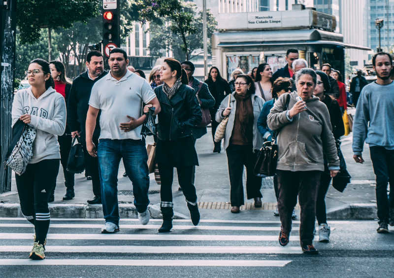
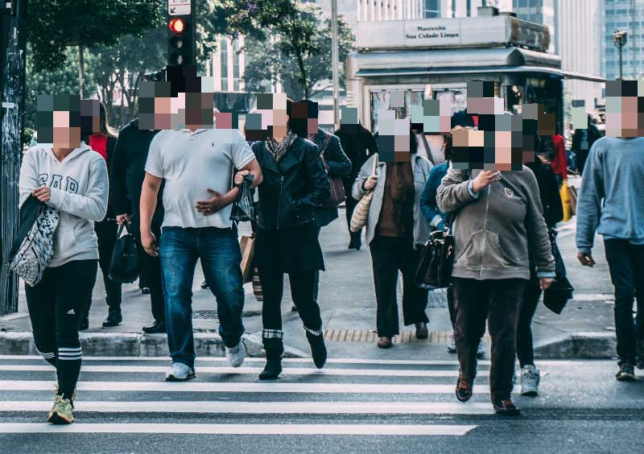
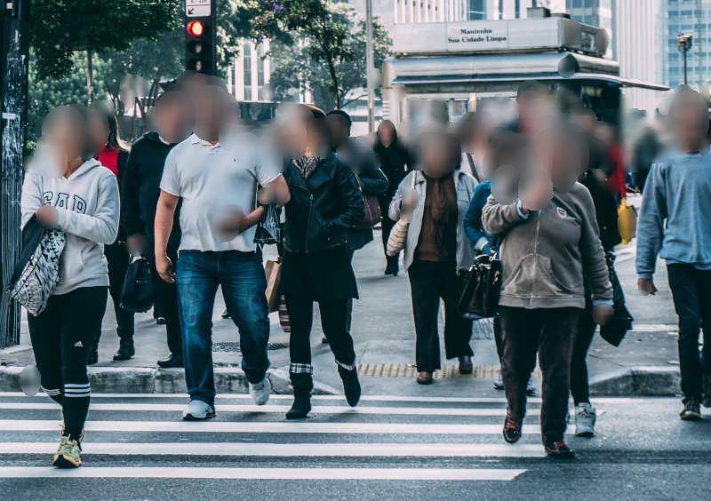
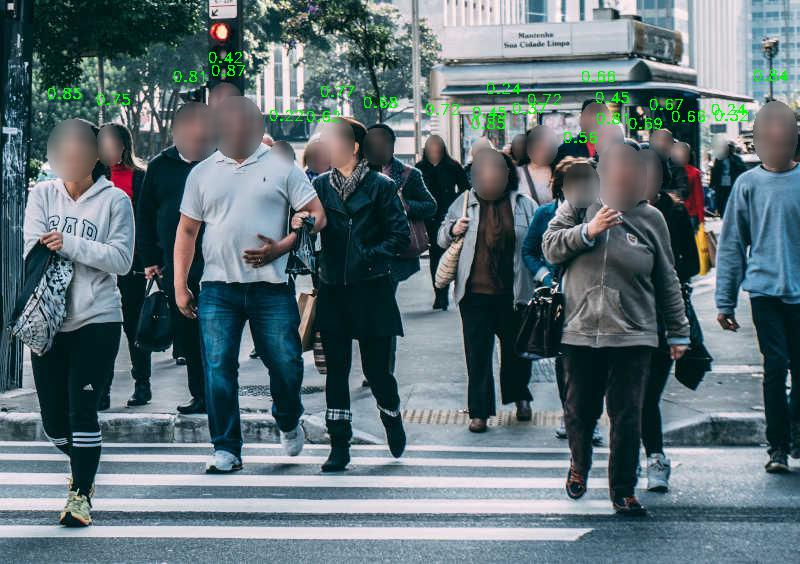

[](https://pypi.org/project/deface/) [](https://github.com/ORB-HD/deface/actions)

# `deface`: Video anonymization by face detection

`deface` is a simple command-line tool for automatic anonymization of faces in videos or photos.
It works by first detecting all human faces in each video frame and then applying an anonymization filter (blurring or black boxes) on each detected face region.
By default all audio tracks are discarded as well.


Original frame | `deface` output (using default options)
:--:|:--:
 | 


## Installation

`deface` supports all commonly used operating systems (Linux, Windows, MacOS), but it requires using a command-line shell such as bash. There are currently no plans of creating a graphical user interface.

The recommended way of installing `deface` is via the `pip` package manager. This requires that you have Python 3.6 or later installed on your system. It is recommended to set up and activate a new [virtual environment](https://realpython.com/python-virtual-environments-a-primer/) first. Then you can install the latest release of `deface` and all necessary dependencies by running:

    $ python3 -m pip install deface

Alternatively, if you want to use the latest (unreleased) revision directly from GitHub, you can run:

    $ python3 -m pip install 'git+https://github.com/ORB-HD/deface'

This will only install the dependencies that are strictly required for running the tool. If you want to speed up processing by enabling hardware acceleration, you will need to manually install additional packages, see [Hardware acceleration](#hardware-acceleration)


## Usage

### Quick start

If you want to try out anonymizing a video using the default settings, you just need to supply the path to it. For example, if the path to your test video is `myvideos/vid1.mp4`, run:

    $ deface myvideos/vid1.mp4

This will write the the output to the new video file `myvideos/vid1_anonymized.mp4`.

### Live capture demo

If you have a camera (webcam) attached to your computer, you can run `deface` on the live video input by calling it with the `cam` argument instead of an input path:

    $ deface cam

This is a shortcut for `$ deface --preview '<video0>'`, where `'<video0>'` (literal) is a  camera device identifier. If you have multiple cameras installed, you can try `'<videoN>'`, where `N` is the index of the camera (see [imageio-ffmpeg docs](https://imageio.readthedocs.io/en/stable/format_ffmpeg.html)).

### CLI usage and options summary

To get an overview of usage and available options, run:

    $ deface -h

The output may vary depending on your installed version, but it should look similar to this:

```
usage: deface [--output O] [--thresh T] [--scale WxH] [--preview] [--boxes]
              [--draw-scores] [--mask-scale M]
              [--replacewith {blur,solid,none,img,mosaic}]
              [--replaceimg REPLACEIMG] [--mosaicsize width] [--keep-audio]
              [--ffmpeg-config FFMPEG_CONFIG] [--backend {auto,onnxrt,opencv}]
              [--execution-provider EP] [--version] [--help]
              [input ...]

Video anonymization by face detection

positional arguments:
  input                 File path(s) or camera device name. It is possible to
                        pass multiple paths by separating them by spaces or by
                        using shell expansion (e.g. `$ deface vids/*.mp4`).
                        Alternatively, you can pass a directory as an input,
                        in which case all files in the directory will be used
                        as inputs. If a camera is installed, a live webcam
                        demo can be started by running `$ deface cam` (which
                        is a shortcut for `$ deface -p '<video0>'`.

optional arguments:
  --output O, -o O      Output file name. Defaults to input path + postfix
                        "_anonymized".
  --thresh T, -t T      Detection threshold (tune this to trade off between
                        false positive and false negative rate). Default: 0.2.
  --scale WxH, -s WxH   Downscale images for network inference to this size
                        (format: WxH, example: --scale 640x360).
  --preview, -p         Enable live preview GUI (can decrease performance).
  --boxes               Use boxes instead of ellipse masks.
  --draw-scores         Draw detection scores onto outputs.
  --mask-scale M        Scale factor for face masks, to make sure that masks
                        cover the complete face. Default: 1.3.
  --replacewith {blur,solid,none,img,mosaic}
                        Anonymization filter mode for face regions. "blur"
                        applies a strong gaussian blurring, "solid" draws a
                        solid black box, "none" does leaves the input
                        unchanged, "img" replaces the face with a custom image
                        and "mosaic" replaces the face with mosaic. Default:
                        "blur".
  --replaceimg REPLACEIMG
                        Anonymization image for face regions. Requires
                        --replacewith img option.
  --mosaicsize width    Setting the mosaic size. Requires --replacewith mosaic
                        option. Default: 20.
  --keep-audio, -k      Keep audio from video source file and copy it over to
                        the output (only applies to videos).
  --ffmpeg-config FFMPEG_CONFIG
                        FFMPEG config arguments for encoding output videos.
                        This argument is expected in JSON notation. For a list
                        of possible options, refer to the ffmpeg-imageio docs.
                        Default: '{"codec": "libx264"}'.
  --backend {auto,onnxrt,opencv}
                        Backend for ONNX model execution. Default: "auto"
                        (prefer onnxrt if available).
  --execution-provider EP, --ep EP
                        Override onnxrt execution provider (see
                        https://onnxruntime.ai/docs/execution-providers/). If
                        not specified, the presumably fastest available one
                        will be automatically selected. Only used if backend is
                        onnxrt.
  --version             Print version number and exit.
  --help, -h            Show this help message and exit.
```

## Usage examples

In most use cases the default configuration should be sufficient, but depending on individual requirements and type of media to be processed, some of the options might need to be adjusted. In this section, some common example scenarios that require option changes are presented. All of the examples use the photo [examples/city.jpg](examples/city.jpg), but they work the same on any video or photo file.

### Drawing black boxes

By default, each detected face is anonymized by applying a blur filter to an ellipse region that covers the face. If you prefer to anonymize faces by drawing black boxes on top of them, you can achieve this through the `--boxes` and `--replacewith` options:

    $ deface examples/city.jpg --boxes --replacewith solid -o examples/city_anonymized_boxes.jpg


### Mosaic anonymization

Another common anonymization option is to draw a mosaic pattern over faces. This is supported with the `--replacewith mosaic` option. The width of each of the quadratic mosaic fragments can be determined using the `--mosaicsize` option (default value: 20). Note that the mosaic size is measured in pixels, so you should consider increasing the size when processing higher-resolution inputs.

Usage example:

    $ deface examples/city.jpg --replacewith mosaic --mosaicsize 20 -o examples/city_anonymized_mosaic.jpg




### Tuning detection thresholds

The detection threshold (`--thresh`, `-t`) is used to define how confident the detector needs to be for classifying some region as a face. By default this is set to the value 0.2, which was found to work well on many test videos.

If you are experiencing too many false positives (i.e. anonymization filters applied at non-face regions) on your own video data, consider increasing the threshold.
On the other hand, if there are too many false negative errors (visible faces that are not anonymized), lowering the threshold is advisable.

The optimal value can depend on many factors such as video quality, lighting conditions and prevalence of partial occlusions. To optimize this value, you can set threshold to a very low value and then draw detection score overlays, as described in the [section below](#drawing-detection-score-overlays).

To demonstrate the effects of a threshold that is set too low or too high, see the examples outputs below:

`--thresh 0.02` (notice the false positives, e.g. at hand regions) | `--thresh 0.7` (notice the false negatives, especially at partially occluded faces)
:--:|:--:
 | 


### Drawing detection score overlays

If you are interested in seeing the faceness score (a score between 0 and 1 that roughly corresponds to the detector's confidence that something *is* a face) of each detected face in the input, you can enable the `--draw-scores` option to draw the score of each detection directly above its location.

    $ deface examples/city.jpg --draw-scores -o examples/city_anonymized_scores.jpg



This option can be useful to figure out an optimal value for the detection threshold that can then be set through the `--thresh` option.


### High-resolution media and performance issues

Since `deface` tries to detect faces in the unscaled full-res version of input files by default, this can lead to performance issues on high-res inputs (>> 720p). In extreme cases, even detection accuracy can suffer because the detector neural network has not been trained on ultra-high-res images.

To counter these performance issues, `deface` supports downsampling its inputs on-the-fly before detecting faces, and subsequently rescaling detection results to the original resolution. Downsampling only applies to the detection process, whereas the final output resolution remains the same as the input resolution.

This feature is controlled through the `--scale` option, which expects a value of the form `WxH`, where `W` and `H` are the desired width and height of downscaled input representations.
It is very important to make sure the aspect ratio of the inputs remains intact when using this option, because otherwise, distorted images are fed into the detector, resulting in decreased accuracy.

For example, if your inputs have the common aspect ratio 16:9, you can instruct the detector to run in 360p resolution by specifying `--scale 640x360`.
If the results at this fairly low resolution are not good enough, detection at 720p input resolution (`--scale 1280x720`) may work better.


## Hardware acceleration

Depending on your available hardware, you can speed up neural network inference by enabling the optional [ONNX Runtime](https://microsoft.github.io/onnxruntime/) backend of `deface`. For optimal performance you should install it with appropriate [Execution Providers](https://onnxruntime.ai/docs/execution-providers) for your system. If you have multiple Execution Providers installed, ONNX Runtime will try to automatically use the fastest one available.

Here are some recommendations for common setups:

### CUDA (only for Nvidia GPUs)

If you have a CUDA-capable GPU, you can enable GPU acceleration by installing the relevant packages:

    $ python3 -m pip install onnx onnxruntime-gpu

If the `onnxruntime-gpu` package is found and a GPU is available, the face detection network is automatically offloaded to the GPU.
This can significantly improve the overall processing speed.

### DirectML (only for Windows)

Windows users with capable non-Nvidia GPUs can enable GPU-accelerated inference with DirectML by installing:

    $ python3 -m pip install onnx onnxruntime-directml

### OpenVINO

OpenVINO can accelerate inference even on CPU-only systems by a few percent, compared to the default OpenCV and ONNX Runtime implementations. It works on Linux and Windows, but not yet on Python 3.11 as of July 2023. Install the backend with:

    $ python3 -m pip install onnx onnxruntime-openvino


### Other platforms

If you your setup doesn't fit with these recommendations, look into the available options at the [Execution Provider](https://onnxruntime.ai/docs/execution-providers/#summary-of-supported-execution-providers) documentation and find the respective installation instructions in the [ONNX Runtime build matrix](https://microsoft.github.io/onnxruntime/).


## How it works

The included face detection system is based on CenterFace ([code](https://github.com/Star-Clouds/centerface), [paper](https://arxiv.org/abs/1911.03599)), a deep neural network optimized for fast but reliable detection of human faces in photos.
The network was trained on the [WIDER FACE](http://shuoyang1213.me/WIDERFACE/) dataset, which contains annotated photos showing faces in a wide variety of scales, poses and occlusions.

Although the face detector is originally intended to be used for normal 2D images, `deface` can also use it to detect faces in video data by analyzing each video frame independently.
The face bounding boxes predicted by the CenterFace detector are then used as masks to determine where to apply anonymization filters.


## Credits

- `centerface.py` is based on https://github.com/Star-Clouds/centerface (revision [8c39a49](https://github.com/Star-Clouds/CenterFace/tree/8c39a497afb78fb2c064eb84bf010c273bb7d3ce)),
  [released under MIT license](https://github.com/Star-Clouds/CenterFace/blob/36afed/LICENSE)
- The included model file `centerface.onnx` is an unmodified copy of the [`centerface_bnmerged.onnx`](https://github.com/Star-Clouds/CenterFace/blob/b82ec0c4844e89fd5a0305986aed9bdf33c72585/models/onnx/centerface_bnmerged.onnx) from https://github.com/Star-Clouds/centerface
- The original source of the example images in the `examples` directory can be found [here](https://www.pexels.com/de-de/foto/stadt-kreuzung-strasse-menschen-109919/) (released under the [Pexels photo license](https://www.pexels.com/photo-license/))
